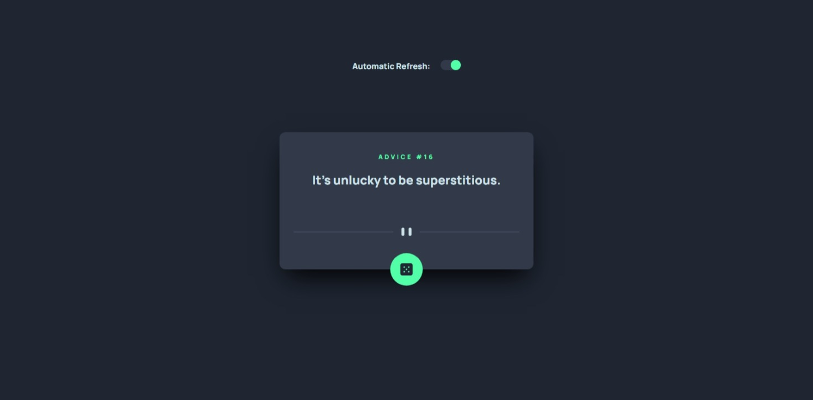

# Frontend Mentor - Advice generator app solution

This is a solution to the [Advice generator app challenge on Frontend Mentor](https://www.frontendmentor.io/challenges/advice-generator-app-QdUG-13db). Frontend Mentor challenges help you improve your coding skills by building realistic projects.

## Table of contents

- [Overview](#overview)
  - [The challenge](#the-challenge)
  - [Screenshot](#screenshot)
  - [Links](#links)
- [My process](#my-process)
  - [Built with](#built-with)
  - [What I learned](#what-i-learned)
  - [Continued development](#continued-development)
- [Author](#author)

## Overview

### The challenge

Users should be able to:

- View the optimal layout for the app depending on their device's screen size
- See hover states for all interactive elements on the page
- Generate a new piece of advice by clicking the dice icon

### Screenshot

### Links

- Solution URL: [https://github.com/Ihezie/advice-generator-app.git](https://github.com/Ihezie/advice-generator-app.git)
- Live Site URL: [https://advice-generator-web-application.netlify.app/](https://advice-generator-web-application.netlify.app/)

## My process

### Built with

- Semantic HTML5 markup
- CSS custom properties
- Flexbox
- CSS Grid
- Mobile-first workflow
- [React](https://reactjs.org/) - JS library
- [tailwindCSS](https://tailwindcss.com/) - For styles
- [axios](https://axios-http.com/) - For Http Requests

### What I learned
What I set out to learn with this project was the axios library, and I think I achieved that.

### Continued development
In future projects, I plan to gain mastery over other useful libraries. 

## Author
- Frontend Mentor - [@Ihezie](https://www.frontendmentor.io/profile/Ihezie)